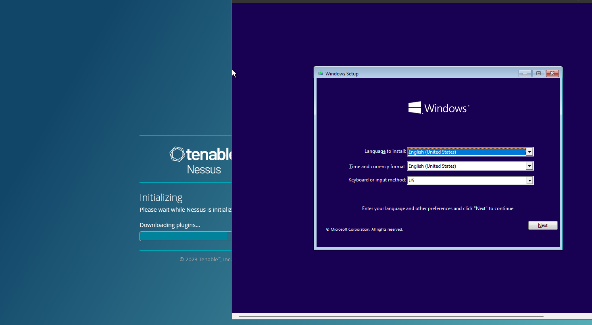
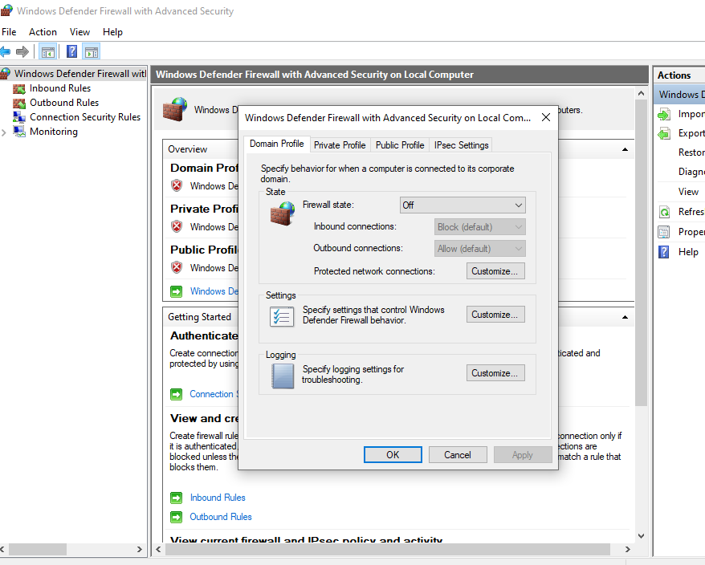
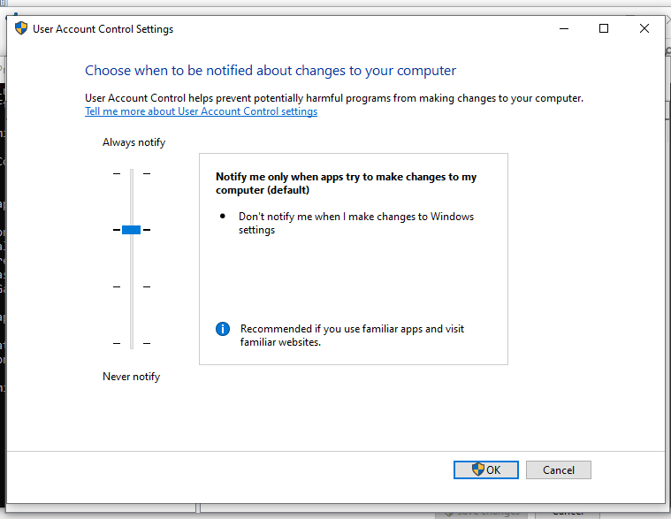
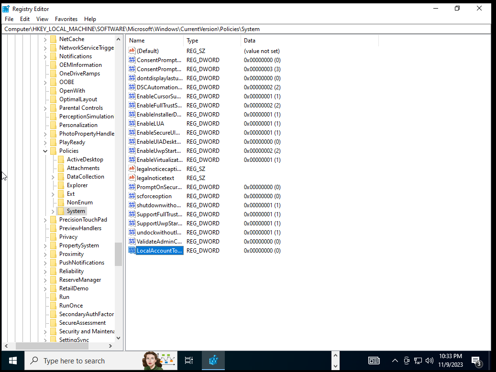
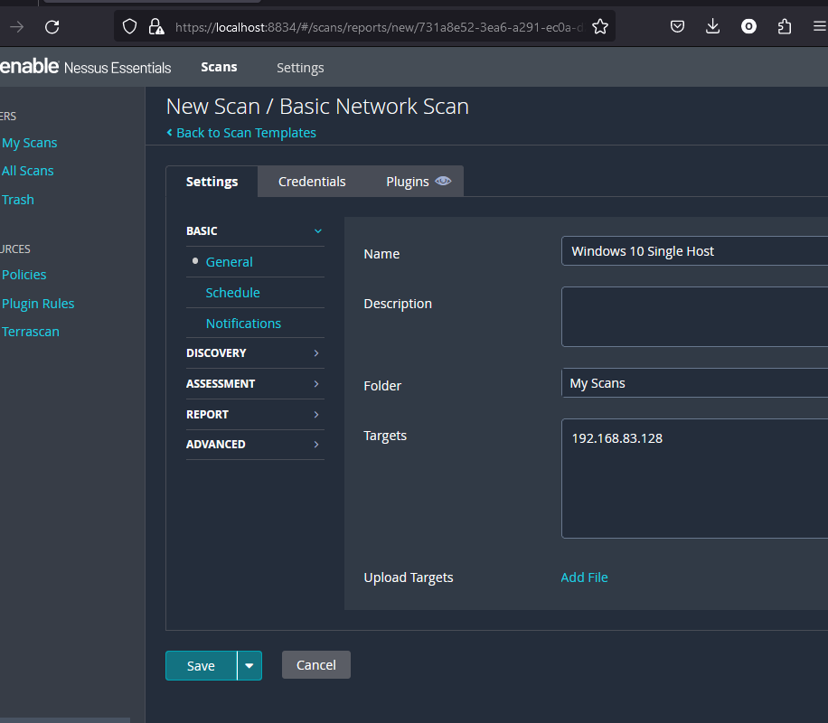
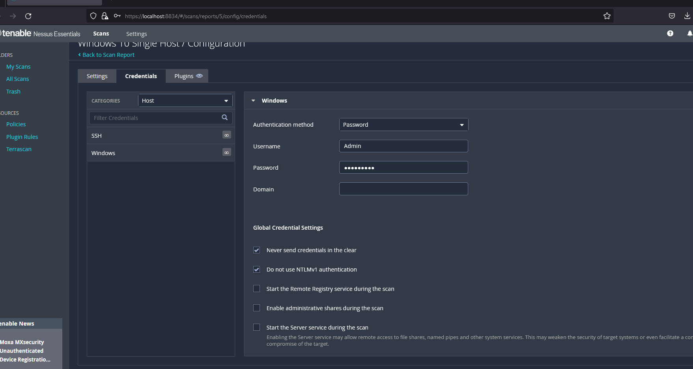
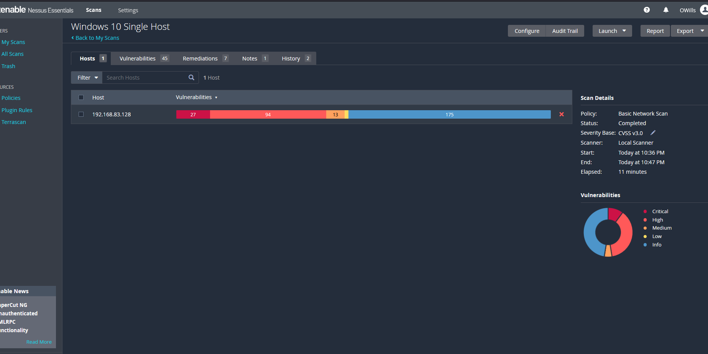
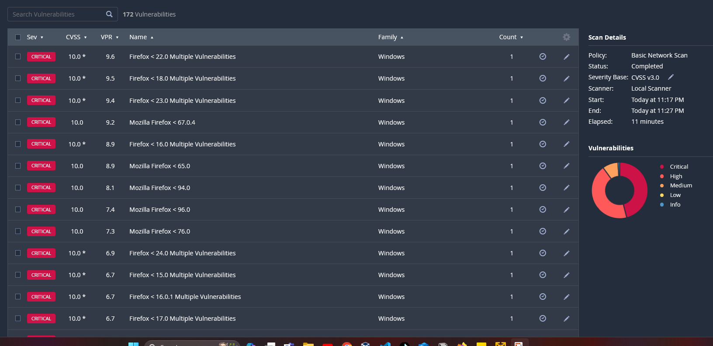
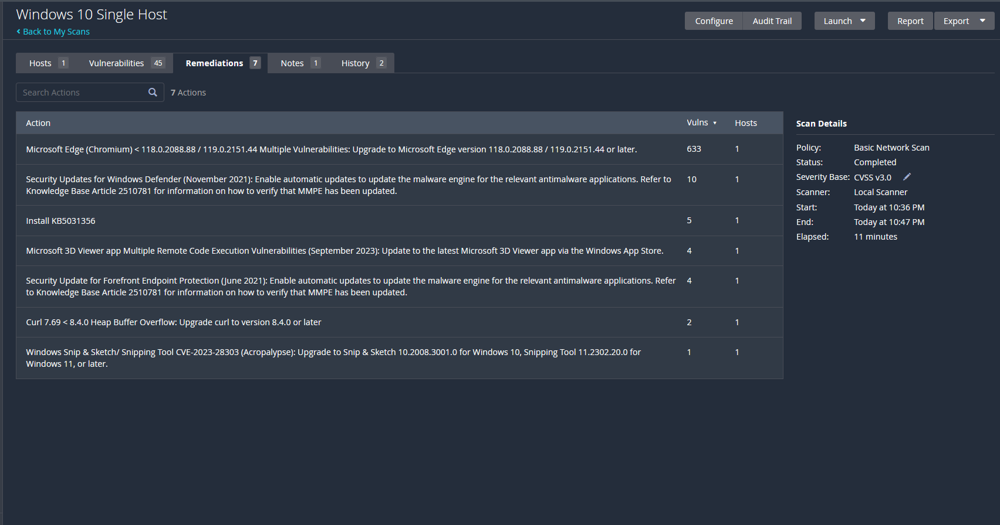
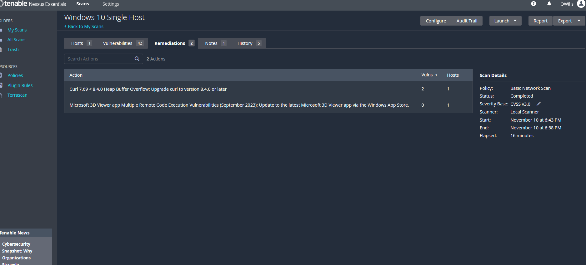

<h1>Description</h1>
  
<h1>Create a Vulnerability Scanner to Scan a Single Host Computer for Vulnerabilites using Nessus</h1>
 
  <h2>1. Create VM and Setting up Nessus Scanner </h2>
 
 
 
 <h2>2. Once Windows 10 VM is setup Disable Firewall </h2>
 <h3> This allows for the Nessus Scanner to accurately scan the vm for any vulnerabilites </h3>
 
 
 
 <h2>3. Turn off notifing any changes that are happening to the vm </h2>
 <h3> This needs to be off so that we do not get any issues when add or changing default settings</h3>
 
 
  
  <h2>4. Navigate to Registry Editor  </h2>
  <h3> Here you will need set up a key to connect to the scanner to scan for any deprecated system on the VM </h3>
  <h3>Go to Computer\HKEY_LOCAL_MACHINE\SOFTWARE\Microsoft\Windows\CurrectVersion\Policies\System</h3>
  <h3> Add the Key LocalAccountTokenFilterPolciy </h3>
   
   
    
  <h2> 5. Log into Nessus and and set up a basic scan </h2>

  
  
  <h2>Run your First Scan </h2>
  
  
    
 <h2> 6. First Scan completed. Not that many Vulnerabilites</h2>
 <h3>First scan is a basic one so it is not going to give much information.</h3>
 
  
  
  <h2> Lets set up a crediatial scan so we can see everything. <h2>
  <h3>To set up, get your account user name and password of your VM </h3>
  <h3> Head over to the scan you created on Nessus and edit it. Add your creditials and run the scan again</h3>
    
  

  <h2>7. More Vulnerabilites show up with a credital Scan</h2>

  

  <h3>Here shows alot of criticial vulnerabilites</h3>

  

  <h2>8. Here are some of the Remediations</h2>
  

  <h3>Clean up some of the Vulnerabilites and criticals</h3>
  <h3>- Update Windows Software
      - Update all native applications on the system
      - if applications are not needed uninstall 
      - update all chrome, edge, firefox etc
  </h3>

  <h3>After update fixed many of the remediations</h3>
  
  

  
